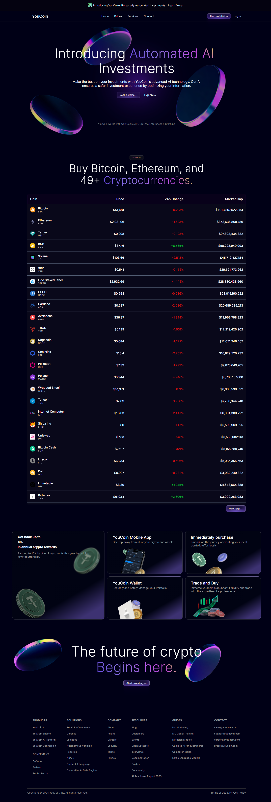
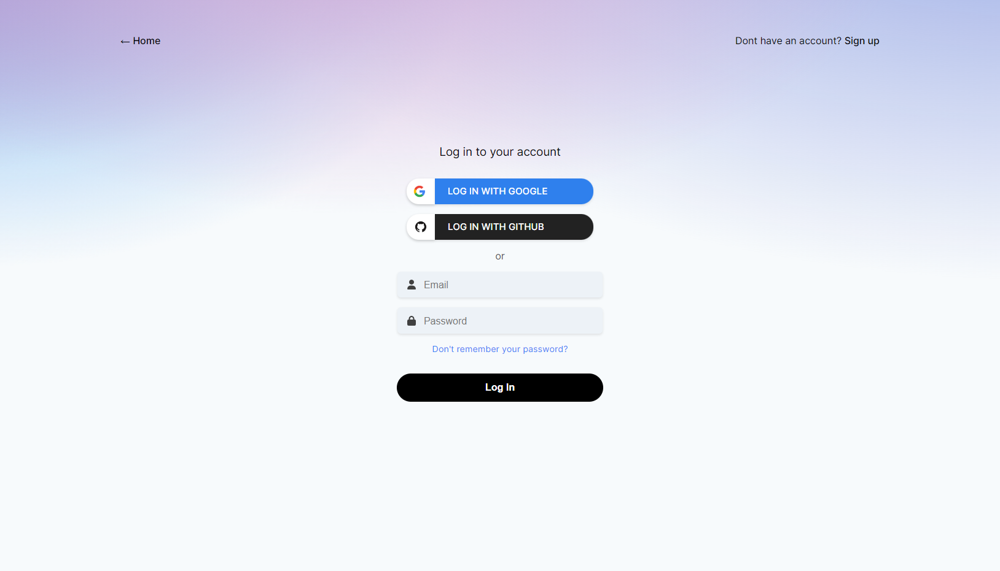
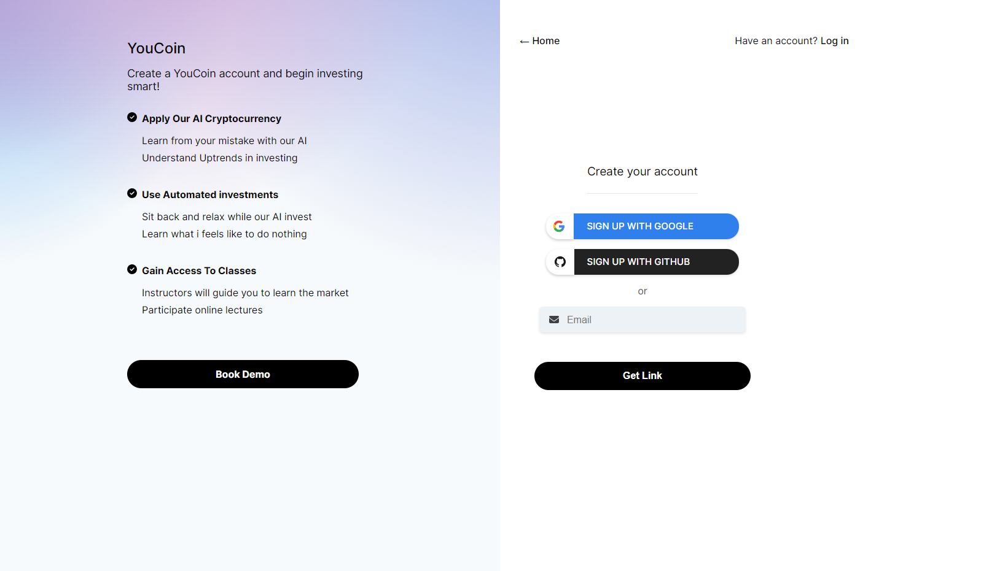
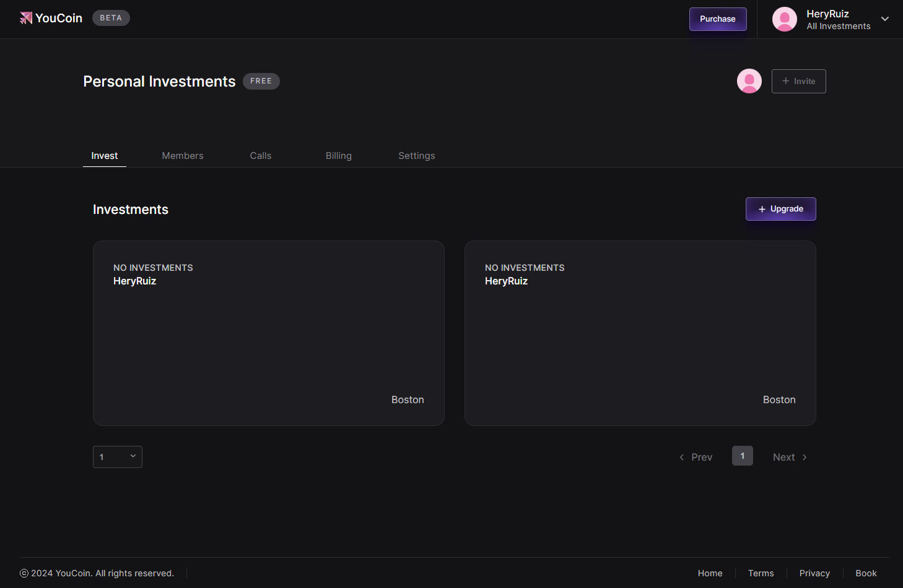
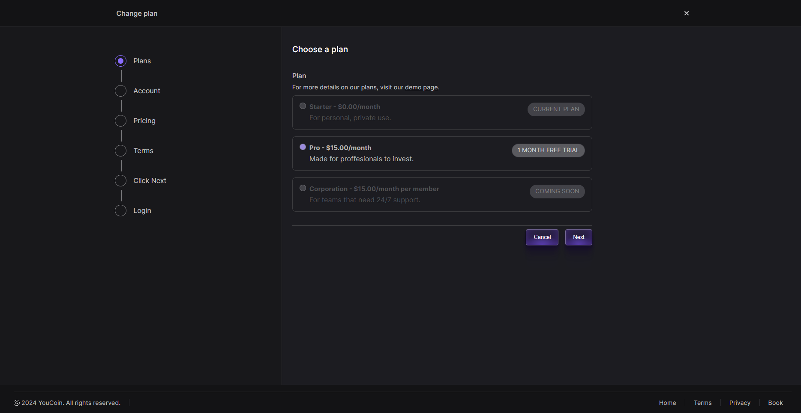
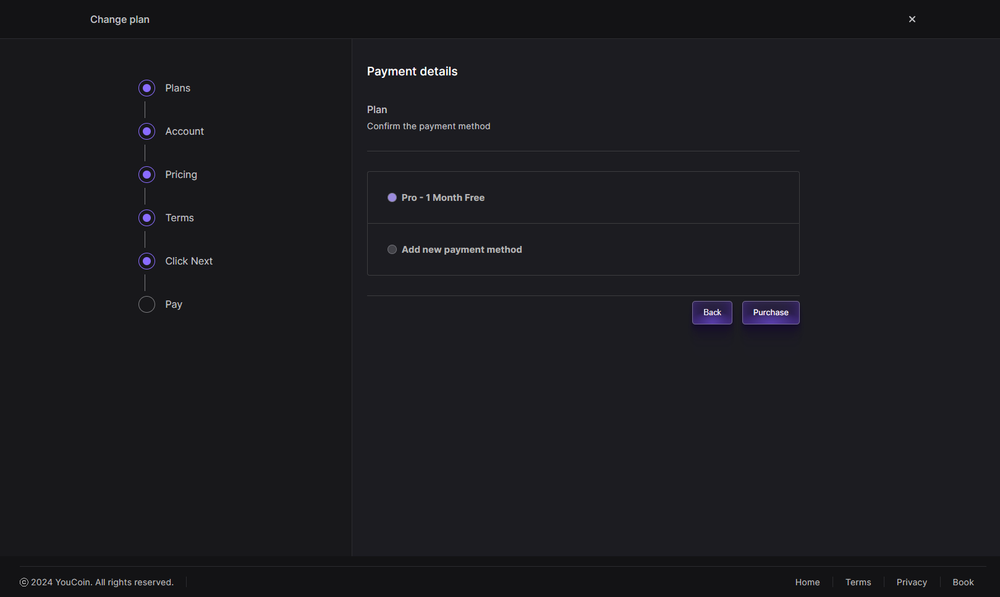
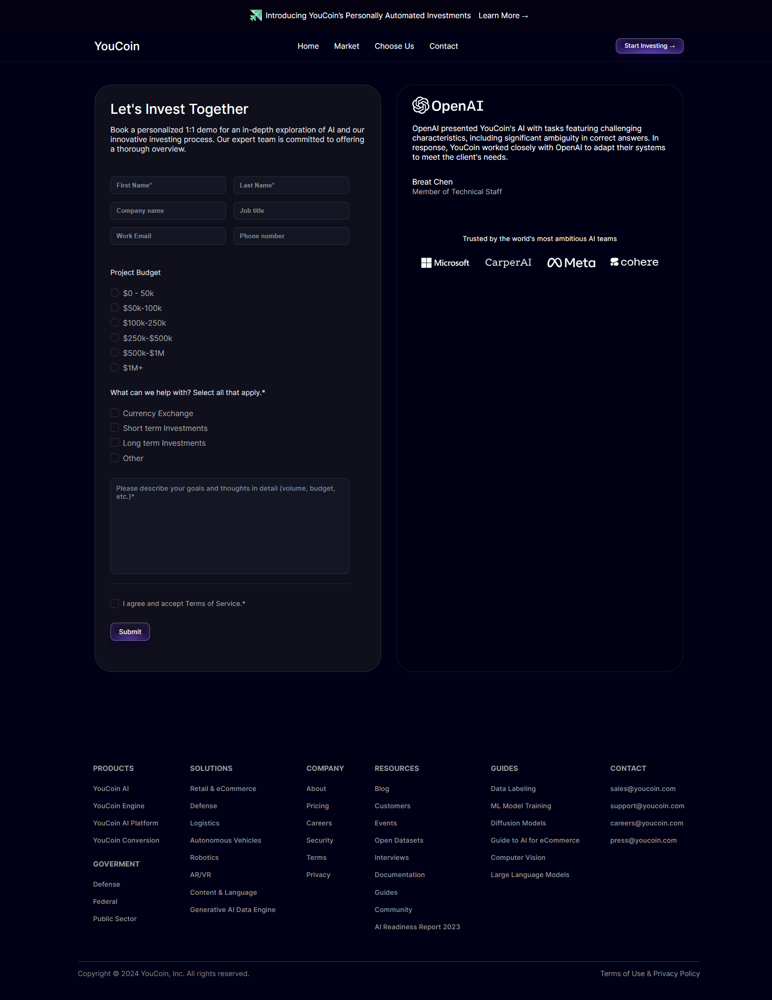
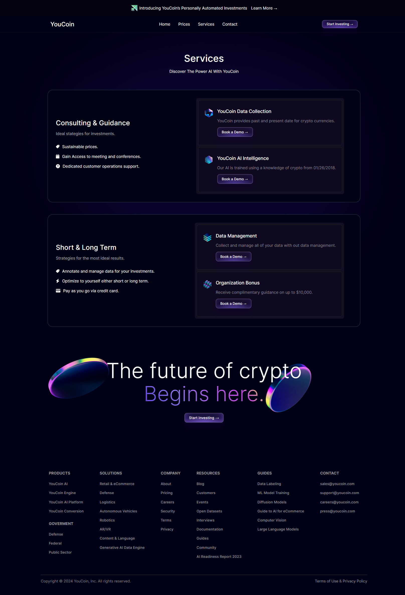
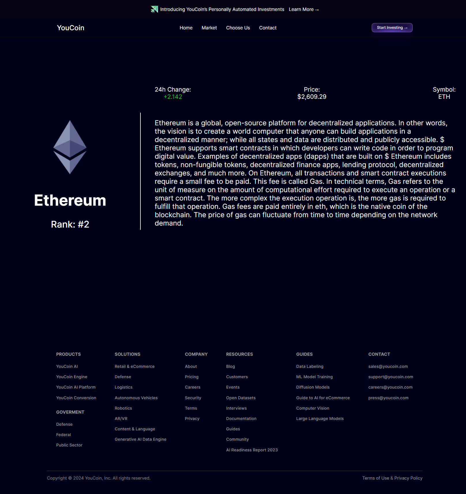
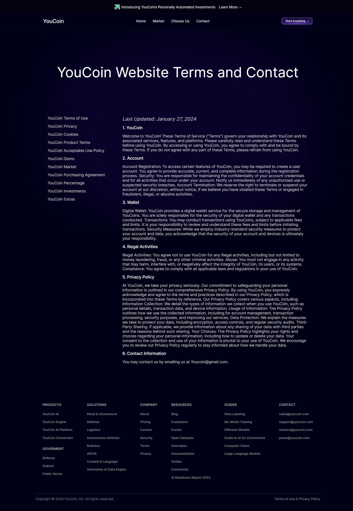

<h2>About the project</h2>

YouCoin was developed using React for the frontend, coupled with JavaScript, HTML, and CSS. The application utilizes the CoinGecko API to fetch cryptocurrency data. Additionally, Firebase was implemented to provide secure authentication functionality and enable storing data into a Realtime database.

👉 Live Demo: <a href='https://youcoin.vercel.app'>YouCoin Demo</a>

<h3>Built using:</h3>

» CoinGecko API  
» React JS  
» Firebase  
» CSS  
» HTML 

 

<h2>Project Screenshots</h2>
 
<h3 align='center'>Home Page 🏠</h3>

  

  

<h3 align='center'>Log In Page 🔒</h3>

  

  
<h3 align='center'>Sign Up Page 🛎️</h3>

  

  
<h3 align='center'>Dashboard Page 🦾</h3>

  

  
<h3 align='center'>Purchase Page 💳</h3>

  

  
<h3 align='center'>Payment Page 💸</h3>

  

  
  <h3 align='center'>Book Page 📖</h3>

  

  
<h3 align='center'>Services Page 📞</h3>

  

  
<h3 align='center'>Coin Page 🪙</h3>

  

<h3 align='center'> Contact Page 📱</h3>

  

  
