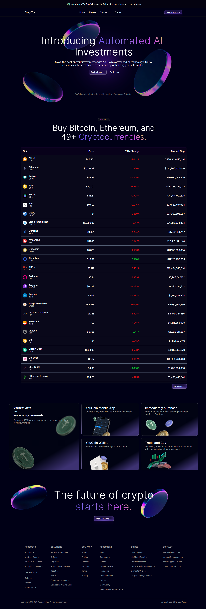
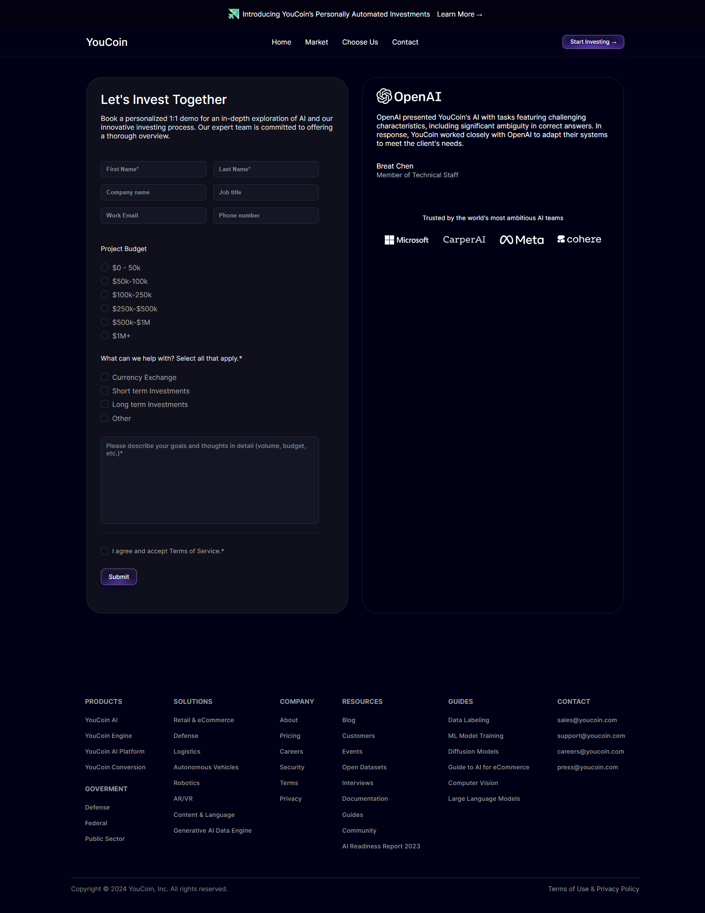
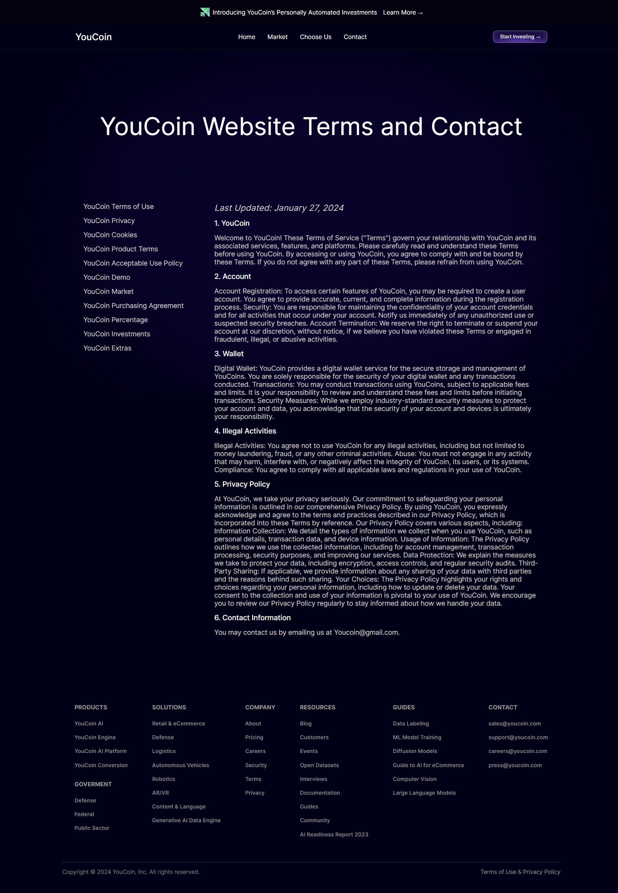

<h2>About the project</h2>

• Successfully integrated the Coingecko API to enhance the user
experience by providing real-time data on the top 50 cryptocurrencies.
 
 
• Utilized state management techniques in React to enhance the
application’s performance and userinteractivity.
 
 
• Incorporating techniques such as lazy loading forimages and other
strategies to improve loading times and user experience. 

👉 Live Demo: <a href='https://youcoin.vercel.app'>YouCoin Demo</a>

<h3>Built using:</h3>

» React JS  
» CSS  
» HTML 

 

<h2>Project Screenshots</h2>
 
<h3 align='center'>Home Page 🏠</h3>

  

  

<h3 align='center'>Book Page 📖</h3>

  

  

<h3 align='center'> Contact Page 📱</h3>

  

